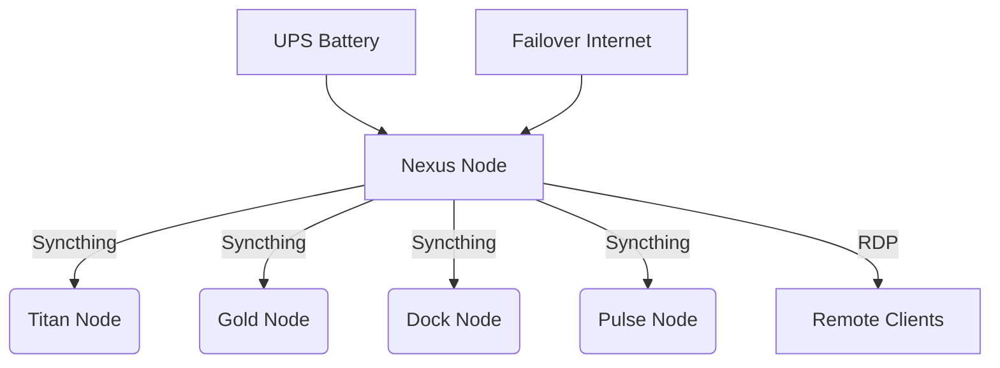

# 🚀 Nexus Node (CELESTIAL) - Central Sync & Cloud Hub  

**Role:** 24/7 cloud server for cross-device synchronization (files, directories) and secure remote access, with built-in UPS protection.  

---

## 📋 Hardware Specs  
- **OS:** Windows 11 Pro  
- **CPU:** Intel Core i3 (8 cores, 3.6GHz)  
- **GPU:** Intel Alder Lake (3.6GB)  
- **RAM:** 8GB DDR4 (3200MHz)  
- **Storage:** 512GB NVMe SSD  
- **Power Backup:** Laptop battery (4h uptime) + surge protection  

---

## 🌟 Key Features  
### 🔄 **Multi-Device Sync**  
- **Syncthing-powered** synchronization across all nodes:  
  - 🖥️ **Titan Node** (Desktop) – Primary workstation  
  - 💻 **Gold Node** (Laptop) – Secondary device  
  - 💻 **Dock Node** (Laptop) – Portable workstation  
  - 📱 **Pulse Node** (Smartphone) – Mobile access  
- Version control & conflict resolution  
- Encrypted peer-to-peer transfers  

### 🖥 **Remote Access**  
- 24/7 RDP/VPS availability  
- Low-latency remote desktop for Windows apps  

### ⚡ **Fail-Safe Protection**  
- **4-hour battery backup** during outages  
- Automated graceful shutdown procedures  

---

## 📡 Network Architecture  

